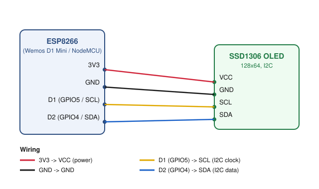

# ESP8266 Koi Pond Simulation

A small koi-pond animation for an ESP8266 driving a 128x64 SSD1306 OLED over I2C.
Koi fish wander a lake dotted with lily-pad leaves, chase down single-pixel
food that spawns at random locations, and avoid crashing into each other or
into the leaves. Only the fish closest to a given piece of active food chases
it — the others keep wandering.

## Features

- Koi fish rendered with a curving, tapered body (see "How It Works" below)
  that bends naturally through turns, plus a wiggling tail fin
- Lily-pad "leaf" obstacles: a filled circle with a Pac-Man-style notch bite
- Single-pixel food that spawns at random, non-overlapping-with-leaves
  positions; multiple food pixels can be active at once, each independently
  claimed by its nearest fish
- "Closest fish only" chase logic with per-food hysteresis (no flapping
  between two near-equidistant fish)
- Steering-based movement: wander / chase / separation (anti-fish-crash) /
  leaf avoidance / boundary avoidance, each as a weighted force, plus a
  hard positional correction as a last-resort safety net so fish never
  visually overlap a leaf or another fish
- All tunables (speeds, counts, radii, timing) centralized in one config file

## Hardware Required

| Qty | Part | Notes |
|-----|------|-------|
| 1 | ESP8266 dev board | Wemos D1 Mini or NodeMCU recommended (this project targets `nodemcu` by default) |
| 1 | SSD1306 OLED display, 128x64, I2C | Common 0.96" module, 4-pin (VCC/GND/SCL/SDA); I2C pull-up resistors are normally already on the breakout board |
| 4 | Jumper wires | Female-to-female if both boards have pin headers |
| 1 | Micro USB cable | Power + programming |

No breadboard is strictly required — 4 direct jumper wires are enough.

## Wiring



| ESP8266 pin | OLED pin | Purpose |
|---|---|---|
| 3V3 | VCC | Power |
| GND | GND | Ground |
| D1 (GPIO5) | SCL | I2C clock |
| D2 (GPIO4) | SDA | I2C data |

These are the default I2C pins on ESP8266 boards and match `I2C_SDA_PIN` /
`I2C_SCL_PIN` in [`src/config.h`](src/config.h) (set as raw GPIO numbers so
the code works on any ESP8266 board variant, not just boards with `D1`/`D2`
silkscreen labels). If your display doesn't light up, double check the I2C
address too — most SSD1306 modules are `0x3C`, but some are `0x3D` (see
Troubleshooting below).

## Software Setup

This is a [PlatformIO](https://platformio.org/) project.

1. Install PlatformIO (either the standalone CLI, or the VS Code extension).
2. Open this folder as a PlatformIO project.
3. Connect the ESP8266 via USB.
4. Build and upload:

```bash
pio run --target upload
```

5. Optional: watch serial output (not currently used for logging, but handy
   for debugging):

```bash
pio device monitor
```

Libraries (`Adafruit SSD1306`, `Adafruit GFX Library`, `Adafruit BusIO`) are
declared in `platformio.ini` and are fetched automatically on first build.

## Project Structure

```
platformio.ini          PlatformIO build configuration
src/
  main.cpp               setup()/loop(), scene init, frame timing
  config.h                all tunable constants (display, timing, motion, visuals)
  vec2.h                  minimal 2D vector math + random-float helper
  fish.h / fish.cpp       Fish struct, steering/movement, chaser assignment
  food.h / food.cpp       Food struct, eat detection, respawn logic
  leaf.h                  Leaf struct (static lily-pad obstacles)
  render.h / render.cpp   drawing functions for fish/leaves/food
docs/
  wiring_diagram.svg      wiring diagram embedded above
```

## How It Works

**Movement** is a simplified steering-behavior model. Each frame, every fish
computes a handful of force vectors and sums them:

- **Wander** (when not chasing food): a slow random walk in heading.
- **Chase** (when assigned as the closest fish to a piece of active food):
  steer directly toward that food.
- **Separation**: steer away from any other fish closer than
  `SEPARATION_DIST`.
- **Leaf avoidance**: steer away from any leaf closer than
  `LEAF_AVOID_RADIUS`.
- **Boundary avoidance**: steer away from the screen edges.

The summed force sets a target heading; the fish's actual heading turns
toward it at a capped rate (`FISH_MAX_TURN_RATE`) so motion stays smooth.
After moving, a hard positional correction pushes the fish out of any leaf
or fish it's still overlapping — this is the actual guarantee against visible
crashes, with the soft steering forces above just making it look natural
rather than jarring.

**Closest-fish-chases logic**: every frame, `assignChaser()` lets each active
food claim its nearest still-unclaimed fish (foods are processed in index
order, so with `NUM_FOOD < NUM_FISH` every food normally gets its own
chaser); every fish that isn't claimed goes back to `WANDER`. A small
hysteresis margin (`CHASE_SWITCH_MARGIN`) keeps a food's chase from
flickering between two fish that are nearly equidistant.

**Food lifecycle**: up to `NUM_FOOD` food pixels can be active at once, each
tracked independently. Each spawns at a random point at least
`LEAF_AVOID_RADIUS` away from every leaf. When a food's assigned chaser gets
within `EAT_DISTANCE` of it, that food is eaten, and a new one spawns after a
random delay between `FOOD_MIN_RESPAWN_MS` and `FOOD_MAX_RESPAWN_MS`.

**Fish visuals** — a curving, chain-like body inspired by "IK fish body"
sketches (like [this one](https://zer02z2.github.io/creative-computing/fish-body-simulation/)),
adapted to be cheap enough for an ESP8266:

- Every fish keeps a rolling history of its last `TRAIL_LEN` positions
  (`Fish::trail` in [`fish.h`](src/fish.h)).
- `NUM_BODY_SEGMENTS` points are sampled out of that history, `SEGMENT_GAP_FRAMES`
  frames apart, to become the body's spine. Because the spine is literally the
  path the fish swam, it curves into a natural S-shape through turns — the
  same visual effect as solving a segment chain every frame, but without any
  of that per-frame trig cost.
- At each spine point, a tapered half-width (`BODY_WIDTH_PROFILE` in
  [`render.cpp`](src/render.cpp)) and a normalized perpendicular (just one
  `sqrt`, no trig) give left/right edge points; consecutive edge pairs are
  filled as a triangle strip to form the body silhouette, capped with a small
  circle for a rounded nose.
- A triangle tail fin extends past the last spine point, its tip swaying side
  to side over time (`FISH_WIGGLE_SPEED`/`FISH_WIGGLE_AMPLITUDE`) for a
  swimming animation.

This is a deliberate simplification of the reference sketch (which solves a
full segment chain with angle constraints, plus separate fin/eye chains) —
pectoral fins and eyes are skipped since at ~12px fish length on a 128x64
1-bit display they cost more legibility than they add. The core visual
payoff (a body that actually bends through turns instead of a rigid rotated
sprite) carries over at a fraction of the CPU cost, which matters with
`NUM_FISH` fish doing this every ~33ms.

**Leaf visuals**: a lily pad is a filled circle with a wedge "bite" cut out
of one side (drawn as a background-colored triangle), matching the notched
leaf shape from the same reference sketch. The notch's two edge points are
computed once at startup (`initLeaves()` in [`main.cpp`](src/main.cpp)) and
stored as fixed offsets, so drawing a leaf needs no trig at all.

## Configuration / Tuning

All tunable values live in [`src/config.h`](src/config.h):

- **Scene population**: `NUM_FISH`, `NUM_LEAVES`, `NUM_FOOD`
- **Timing**: `FRAME_INTERVAL_MS`, `FOOD_MIN_RESPAWN_MS`, `FOOD_MAX_RESPAWN_MS`
- **Motion**: `FISH_SPEED`, `FISH_MAX_TURN_RATE`, `WANDER_JITTER`, and the
  weight/distance constants for separation, leaf avoidance and boundary
  avoidance
- **Body shape**: `NUM_BODY_SEGMENTS`, `SEGMENT_GAP_FRAMES`, `FISH_MAX_HALF_WIDTH`,
  `TAIL_FIN_LENGTH`, wiggle speed/amplitude, plus `BODY_WIDTH_PROFILE` (the
  per-segment taper shape) at the top of [`render.cpp`](src/render.cpp)
- **Leaf visuals**: `LEAF_RADIUS`, `LEAF_NOTCH_HALF_ANGLE`

Increasing `NUM_FISH` or `NUM_LEAVES` beyond a handful on a 128x64 screen
will make the avoidance behaviors work much harder and may need looser
`SEPARATION_DIST` / `LEAF_AVOID_RADIUS` values to keep things from looking
crowded.

Note that `SEGMENT_GAP_FRAMES` is tuned against the default `FISH_SPEED`
(visual body length is roughly `(NUM_BODY_SEGMENTS - 1) * SEGMENT_GAP_FRAMES
* FISH_SPEED` px) — if you change `FISH_SPEED` a lot, revisit
`SEGMENT_GAP_FRAMES` to keep the fish a sensible size.

## Troubleshooting

- **Blank screen / boot loops on `display.begin()` failure**: the code halts
  in a loop if the SSD1306 isn't found at `SCREEN_ADDRESS`. Try `0x3D`
  instead of `0x3C` in `config.h`, and double check wiring/power.
- **Fish look jittery**: lower `FISH_MAX_TURN_RATE` or `WANDER_JITTER` in
  `config.h`.
- **Fish seem to ignore food**: check `EAT_DISTANCE` isn't too small relative
  to `FISH_SPEED` (a fast fish can overshoot a very small eat radius between
  frames).

## Possible Extensions

- Pectoral fins or eyes on the fish (skipped for now — see "How It Works")
- Bubble particles or a day/night background dim cycle
- Button/PIR input to summon food at a chosen spot
- Persist a "fish fed" counter to EEPROM/LittleFS
